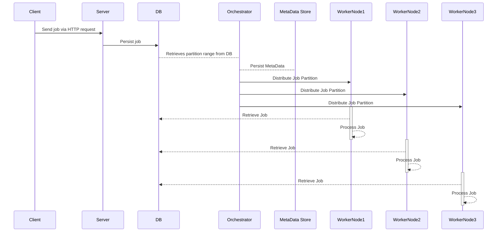

# SCHEDIN
Basically, Kubernetes for Job Scheduling but Lightweight [Experimental]

## High-Level Architecture [Under Construction]

```mermaid
sequenceDiagram
    participant Client as Client
    participant Server as Server
    participant DB as DB

    participant Orchestrator as Orchestrator
    participant MetaDataStore as MetaData Store

    Client->>Server: Send job via HTTP request
    Server->>DB: Persist job

    DB-->Orchestrator: Retrieves partition range from DB
    Orchestrator-->MetaDataStore: Persist MetaData
    Orchestrator->>WorkerNode1: Distribute Job Partition
    Orchestrator->>WorkerNode2: Distribute Job Partition
    Orchestrator->>WorkerNode3: Distribute Job Partition

    activate WorkerNode1
    WorkerNode1-->>DB: Retrieve Job
    WorkerNode1-->>WorkerNode1: Process Job
    deactivate WorkerNode1

    activate WorkerNode2
    WorkerNode2-->>DB: Retrieve Job
    WorkerNode2-->>WorkerNode2: Process Job
    deactivate WorkerNode2

    activate WorkerNode3
    WorkerNode3-->>DB: Retrieve Job
    WorkerNode3-->>WorkerNode3: Process Job
    deactivate WorkerNode3

```
